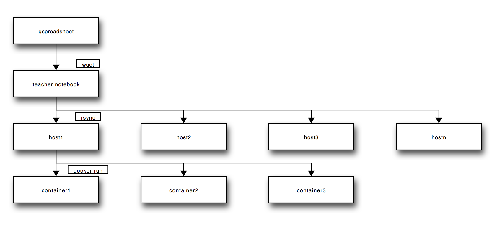

# Docker Image For Managing Big Data

The docker image for the managing big data course is based on the
pyspark docker image from [docker
stacks](https://github.com/jupyter/docker-stacks/).

## Overview

This project assumes that a teacher (or operator) runs one docker container of
a certain image for each student in a course. The containers are distributed over
a set of hosts.

[](http://interactive.blockdiag.com/?compression=deflate&src=eJxtkMEKwjAMhu99irK7B-dFGPNFRCRrs62sNCPNEBXf3QxhHrpj_nz5_yRdJDf5AIN9G-KASUACJdvamVgYgjTGYw9LlHtPSXJ4oTbPjTFDnhnB5xFR7OFiEwl2RJO9RugwttVjQKluShYdQXAj8jayUhukViNlOW4052dye0hdSqdSSo35-Wnt9AQICfnv7vUBugovaY0oyXpP1JjPF9UDa7A)

## Building the Image

The image is designed to run in the home directory of the teacher.
To avoid having to set the directory to world-writable, we have to
configure the docker containers to run under the same user id. As
there many files associated with the user in the docker image,
dynamically changing the user id and username in the ``docker run``
costs a lot of time.  Instead, we chose for the solution of modifying
the base configuration to reflect the userid of the teacher. To
update this, change the following lines in ``base-notebook/Dockerfile``:

    ENV NB_USER datacamp
    ENV NB_UID 17685226

to

    ENV NB_USER $TEACHER_USERNAME
    ENV NB_UID $USERID_TEACHER

where ``$TEACHER_USERNAME`` is the username of the teacher and
``$USERID_TEACHER`` is the corresponding unix user id. Unfortunately,
this solution requires re-building the whole stack until
``pyspark-notebook``. This is done in the script ``build.sh``.

## Running A Course

To run a course, one container has to be started per user. This is
achieved by creating a google spread sheet file containing all users
(teachers and students). The schema with some sample data looks as
follows (see [here](https://docs.google.com/spreadsheets/d/1-B2VSvY8iyBNxeTRmxve7-283pKBC56RSuB6_clDhVw/edit?usp=sharing) for a template):

| SNumber | Name   | LastName | Email | mbd_url                             | mbd_server | mbd_port | Password | Admin |
| ------- | ----   | -------- | ----  | -------                             | ---------- | -------- | -------- | ------ |
| mXXXXXX | John   | Smith    | XXX   | http://farm01.ewi.utwente.nl:20000/ | farm01     | 20000    | W7pyhH0f | FALSE |
| sYYYYYY | Babara | Smith    | YYYY  | http://farm03.ewi.utwente.nl:20001/ | farm03     | 20001    | IBCsaFwu | FALSE |

This spreadsheet can be initially filled by importing a userlist from
blackboard. The fields without non-obvious meaning are:

* ``mbd_server``: the server the notebook of this user should be run
* ``mbd_port``: the external port on which the notebook container will listen
* ``mbd_url``: A string function (using CONCAT()) that forms an URL suitable to be mailed to students.
* ``Password``: The password for the notebook (see below).
* ``Admin``: TRUE/FALSE, whether the user should be a admin user.  

To generate the password for ``Password`` the following spreadsheet
function was used (Using Tools / Script Editor)

    function genPass(l) {
      var possible = "ABCDEFGHIJKLMNOPQRSTUVWXYZabcdefghijklmnopqrstuvwxyz0123456789";
      var text = "";
      for( var i=0; i < l; i++ ) 
          text += possible.charAt(Math.floor(Math.random() * possible.length));

       return text;
    }

Once the spreadsheet is created, two files have to be edited:

* ``hosts``: this file contains all the hosts on which docker containers will run.
* ``sync.sh``: this script that starts the docker containers by copying the spreadsheet 
  and the script ``bin/manage_nb.py`` to all hosts and then executing the script.

If the script ``sync.sh`` is invoked it starts the containers on the hosts indicated in the mbd_server
field. 

Once the containers are started, the users should be informed using
the downloaded csv file. In the past, the Thunderbird add-on Mail
Merge was used.

## Creating Assignments

To understand how assignments can be created, one has to understand the directory structure, where files for this course are stored, which is the following:

<pre>
├── bin                         these are utility scripts
│   ├── build.sh
│   ├── create_release.sh
│   ├── distribute_release.sh
│   ├── insertTOC.py
│   ├── manage_nbs.py
│   └── removeSolutions.py
├── students                    this folder contains one folder per student, containing all his submissions.
│   ├── sXXXXX
│   ├── sYYYYY
├── teacher
│   ├── assignments             this folder contains a version of the assignments that is ready to be distributed to students
│   │   ├── assignment1
│   │   └── assignment2
│   └── solutions               this folder contains assignments together with their solutions.
│       ├── assignment1
│       └── assignment2
└── users.csv
</pre>

To produce an assignment you can follow this procedure:

1. Create a folder in ``teacher/solutions``, say ``assignment3``. Solutions to exercies should be enclosed in ###BEGIN SOLUTION ###END SOLUTION markers.
2. Inside an administrator notebook open a termina, and call ``bin/create_release.sh assignment3``, which first removes all solutions between the given markers and saves these files under ``teacher/assignments/assignment3``.
3. Call ``bin/distribute_release.sh assignment3``, which copies ``teacher/assignments/assignment3`` into the directory of each student under ``students/``.


# Old Readme from docker-stacks

[](https://travis-ci.org/jupyter/docker-stacks)
[](https://gitter.im/jupyter/jupyter?utm_source=badge&utm_medium=badge&utm_campaign=pr-badge&utm_content=badge)

Opinionated stacks of ready-to-run Jupyter applications in Docker.

## Quick Start

If you're familiar with Docker, have it configured, and know exactly what you'd like to run, this one-liner should work in most cases:

```
docker run -d -P jupyter/<your desired stack>
```

## Getting Started

If this is your first time using Docker or any of the Jupyter projects, do the following to get started.

1. [Install Docker](https://docs.docker.com/installation/) on your host of choice.
2. Open the README in one of the folders in this git repository.
3. Follow the README for that stack.

## Visual Overview

Here's a diagram of the `FROM` relationships between all of the images defined in this project:

[](http://interactive.blockdiag.com/?compression=deflate&src=eJyFzbEOgkAMgOGdp7iwsxsJRjZ3R2NMjyumcrTkrsag8d3l3I6F9e_X1nrpBkdwN5_CGAmErKAkbBozSdAApPUycdjD0-utF9ZIb1zGu9Rbc_Fg0TelQ0vA-wfGSHg8n9ryWhd_UR2MhYgVi6IVGdJeFpIYiWkEn6F1Sy52NM2Zyksyihwl9F5eG9CBwlKRO9x8HDZuTXOcIAyZWrfkwPtqLb8_jh2GrQ)

## Stacks, Tags, Versioning, and Progress

Starting with [git commit SHA 9bd33dcc8688](https://github.com/jupyter/docker-stacks/tree/9bd33dcc8688):

* Nearly every folder here on GitHub has an equivalent `jupyter/<stack name>` on Docker Hub (e.g., all-spark-notebook &rarr; jupyter/all-spark-notebook).
* The `latest` tag in each Docker Hub repository tracks the `master` branch `HEAD` reference on GitHub.
* Any 12-character image tag on Docker Hub refers to a git commit SHA here on GitHub. See the [Docker build history wiki page](https://github.com/jupyter/docker-stacks/wiki/Docker-build-history) for a table of build details.
* Stack contents (e.g., new library versions) will be updated upon request via PRs against this project.
* Users looking to remain on older builds should refer to specific git SHA tagged images in their work, not `latest`.
* For legacy reasons, there are two additional tags named `3.2` and `4.0` on Docker Hub which point to images prior to our versioning scheme switch.

## Other Tips and Known Issues

* `tini -- start-notebook.sh` is the default Docker entrypoint-plus-command in every notebook stack. If you plan to modify it in any way, be sure to check the *Notebook Options* section of your stack's README to understand the consequences.
* Every notebook stack is compatible with [JupyterHub](https://jupyterhub.readthedocs.io) 0.5.  When running with JupyterHub, you must override the Docker run command to point to the [start-singleuser.sh](base-notebook/start-singleuser.sh) script, which starts a single-user instance of the Notebook server.  See each stack's README for instructions on running with JupyterHub.
* Check the [Docker recipes wiki page](https://github.com/jupyter/docker-stacks/wiki/Docker-Recipes) attached to this project for information about extending and deploying the Docker images defined here. Add to the wiki if you have relevant information.
* All stacks that derive from minimal-notebook have the conda jpeg package pinned to version 8 until https://github.com/jupyter/docker-stacks/issues/210 is resolved upstream.

## Maintainer Workflow

**For PRs that impact the definition of one or more stacks, do the following:**

1. Make sure Travis is green.
2. Merge the PR.
3. `ssh -i ~/.ssh/your-github-key build@docker-stacks.cloudet.xyz`
4. Run these commands on that VM.

```
# join the shared tmux session
tmux a
cd docker-stacks
# make sure we're always on clean master from github
git fetch origin
git reset --hard origin/master
# retry on failure up to 10 times with a (60 * iteration)
# second delay in-between
make retry/release-all
```

When `make retry/release-all` successfully pushes the last of its images to Docker Hub (currently `jupyter/all-spark-notebook`), Docker Hub invokes [the webhook](https://github.com/jupyter/docker-stacks/blob/master/internal/docker-stacks-webhook/) which updates the [Docker build history](https://github.com/jupyter/docker-stacks/wiki/Docker-build-history) wiki page.

**When there's a security fix in the Debian base image, do the following in place of the last command:**

Update the `debian:jessie` SHA in the most-base images (e.g., base-notebook). Submit it as a regular PR and go through the build process.

This will take time as the entire set of stacks will rebuild.

**When there's a new stack, do the following before trying to `make rety/release-all`:**

1. Create a new repo in the `jupyter` org on Docker Hub named after the stack folder in the git repo.
2. Grant the `stacks` team permission to write to the repo.
3. Copy/paste the short and long descriptions from one of the other docker-stacks repos on Docker Hub. Modify the appropriate values.

**When there's a new maintainer, do the following:**

1. Add the GitHub user to the Jupyter org, *Docker image maintainers* team.
2. Get the GitHub user's public key from https://github.com/<USERNAME>.keys.
3. `ssh -i ~/.ssh/your-github-key build@docker-stacks.cloudet.xyz`
4. Add the user's public key to `~/.ssh/authorized_keys` with his/her GitHub username as the comment after the key.
